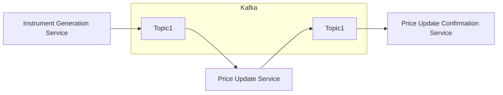

## Demo of Spring Cloud Data Flow with Kafka-Binder


## Table of Contents

- [Introduction](#introduction)
- [Design](#design)
- [Prerequisites](#prerequisites)
- [Build](#build)
- [Run](#run)
- [References](#references)

### Introduction

This demonstration features the seamless integration of Spring Cloud Data Flow with Kafka-Binder, incorporating three
distinct microservices: the Instrument Generation Service as the data source, the Instrument Price Update Service as the
data processor, and the Instrument Price Update Confirmation Service as the data sink. The objective is to interconnect
these microservices, establishing a cohesive data workflow/pipeline and executing the workflow.

### Overview of Microservices

#### Instrument Generation Service

- Creates a random stock instrument object with the instrument's name.
- Produces this stock instrument as a message to a topic on the message broker.

#### Instrument Price Update Service

- Listens to a topic on the message broker to receive instrument names.
- Updates the prices of stock instruments.
- Produces the updated stock instruments as a message to another topic on the message broker.

#### Instrument Price Update Confirmation Service

- Listens to a topic on the message broker to receive stock instruments with updated prices.
- Writes the price update confirmation to the console (stdout).

### Overview of Spring Cloud Data Flow Setup

The microservices are configured and orchestrated using the Spring Cloud Data Flow framework.
Here's an overview of the
process:

#### Registration of Microservices

Microservices are registered as applications with the Spring Cloud Data Flow server.
The path to the executable JAR files is specified during registration.

#### Stream Creation

Streams (workflows/pipelines) are created using the registered applications.
A common configuration for using Kafka as a message broker is specified during stream creation.
This approach ensures consistency across all applications within the stream.

#### Deployment

Once a stream is created, it is deployed to initiate data processing.

The stream is setup with a common configuration to use Kafka as a message broker. This is not configured at each
application level, but instead specified at the time of creating a stream. This allows all the apps in the stream to
use the same Kafka configuration.

The docker-compose setup defines all the base services required to run the entire workflow.

### Design



### Prerequisites

- [Docker](https://www.docker.com/products/docker-desktop/)
- [Docker Compose](https://docs.docker.com/compose/)
- [make](https://formulae.brew.sh/formula/make)

### Build

```shell
make build
```

### Run

```shell
make start-services
```

With all services up, access:

| Description                      | Link                            |
|----------------------------------|---------------------------------|
| Kafka UI                         | http://localhost:8080           | 
| Grafana UI                       | http://localhost:3000           |                 
| Spring Cloud Data Flow Dashboard | http://localhost:9393/dashboard |                 

#### References:

- https://dataflow.spring.io/docs/installation/local/docker/
- https://docs.spring.io/spring-cloud-dataflow/docs/current/reference/htmlsingle/#configuration-local-streams
- https://cloud.spring.io/spring-cloud-stream-binder-kafka/spring-cloud-stream-binder-kafka.html
